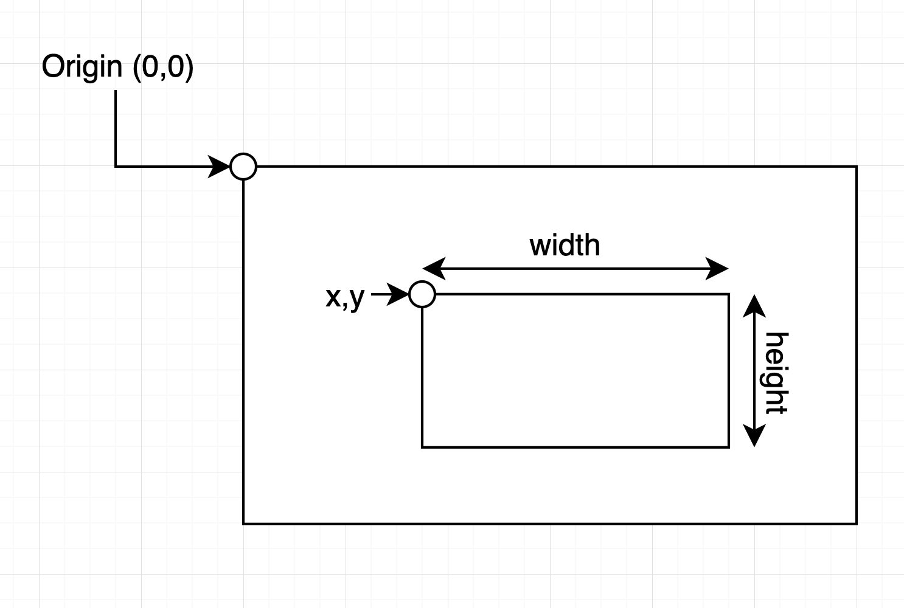
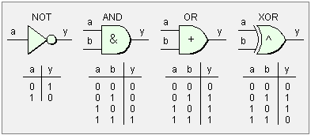

<div class="grid cards" markdown>
- :ledger: Para acompanhar esta seção, abra o arquivo `notebooks/2-operacoesbasicas.ipynb`.
</div>

Nesta seção iremos aprender as principais operações básicas utilizadas em pipelines de processamento de imagens.

1. Conversão de espaços de cor (Escala de Cinza, RGB, HSV)
2. Extração de regiões de interesse (ROI)
3. Desenho de formas geométricas e textos na imagem
4. Operações lógicas entre imagens

---
## Importando as bibliotecas necessárias

Vamos iniciar importando as bibliotecas necessárias para esta seção: `numpy`, `cv2` e `matplotlib.pyplot`.

```python
# Importe as bibliotecas aqui
import numpy as np
import cv2
import matplotlib.pyplot as plt
```

---
## Conversão de Espaços de Cores

Os espaços de cores são maneiras de representar cores, cada um com diferentes finalidades. Os principais espaços de cores usados no processamento de imagens incluem

- Escala de Cinza
- RGB (Red, Green, Blue)
- HSV (Hue/Matiz, Saturação, Brilho)

No OpenCV, a função `cv2.cvtColor()` é utilizada para conversão entre os espaços.

Vamos carregar a imagem `media/gatogordo.jpg` no formato BGR.

```python
# Carregue a imagem colorida (flag 1)
imagem_bgr = cv2.imread("media/gatogordo.jpg", 1)

# Plote a imagem com Matplotlib
plt.imshow(imagem_bgr)
```

### Conversão para RGB

Na seção anterior realizamos a conversão de BGR para RGB manualmente, mas também é possível utilizar a função `cv2.cvtColor()`

> Flag: `cv2.COLOR_BGR2RGB`

RGB é o espaço de cores mais comum, onde cada cor é definida por uma combinação de três valores, que representam a intensidade de cada cor primária: vermelho, verde e azul. A maioria das imagens digitais é representada em RGB.

```python
# Converta a imagem de BGR para RGB
imagem_rgb = cv2.cvtColor("media/gatogordo.jpg", cv2.COLOR_BGR2RGB)

# Plote a imagem com Matplotlib
plt.imshow(imagem_rgb)
```

### Conversão para Grayscale (Escala de Cinza)

É um espaço de cores com apenas uma dimensão, representando variações de intensidade de luz, indo do preto (valor 0) ao branco (valor 255). Não contém informações de cor, apenas a intensidade luminosa.

> Flag: `cv2.COLOR_BGR2GRAY`

```python
# Converta a imagem de BGR para GRAY
imagem_gray = cv2.cvtColor(imagem_bgr, cv2.COLOR_BGR2GRAY)

# Plote a imagem com Matplotlib
plt.imshow(imagem_gray, cmap="grey")
```

### HSV (Hue, Saturation, Value) 

Esse espaço de cores representa as cores de uma forma mais intuitiva:

- Hue (Matiz): Representa a cor (0 a 360° no círculo cromático).
- Saturation (Saturação): Define a “pureza” ou intensidade da cor (0 a 100%).
- Value (Valor de Brilho): Representa o brilho da cor (0 a 100%).

> Flag: `cv2.COLOR_BGR2HSV`

```python
# Converta a imagem de BGR para HSV
imagem_hsv = cv2.cvtColor(imagem_bgr, cv2.COLOR_BGR2HSV)
```

<div class="grid cards" markdown>
- :bulb: **Tente exibir cada componente (canal) da imagem em HSV separadamente utilizando o mapa de cores `hsv` do Matplotlib.**
</div>

---
## Extração de Regiões de Interesse (ROI)

Em muitos projetos será necessário tratar partes específicas de uma imagem, denominadas Regiões de Interesse (ROI). Para extrair uma ROI é possível usar a ferramenta de slicing do NumPy.

Em uma imagem colorida (RGB), geralmente representada por um array com a forma (altura, largura, canais), o slicing permite selecionar uma parte da imagem, definindo intervalos para as dimensões de altura e largura.

A operação de slicing é feita com a seguinte sintaxe: `imagem[a1:b1, a2:b2, c1:c2]`. O operador `:` permite a seleção de todos os elementos entre `a` e `b`.

> **Extraia uma ROI contendo a imagem inteira:**

```python
# Extraia uma ROI contendo a imagem inteira
roi = imagem_rgb[:, :, :]

# Exiba a ROI com Matplotlib
plt.imshow(roi)
```

> **Extraia uma ROI contendo a metade esquerda da imagem:**

```python
# Extraia uma ROI contendo a metade esquerda da imagem
roi = imagem_rgb[:, :600, :]

# Exiba a ROI com Matplotlib
plt.imshow(roi)
```

> **Agora vamos extrair apenas a face do Gato:**

```python
# Extraia uma ROI explicitamente contendo a face do gato
roi = imagem_rgb[150:550, 500:950, :]

# Exiba a ROI com Matplotlib
plt.imshow(roi)
```

---
## Desenhando Formas Geométricas na Imagem

Nesta seção vamos explorar as funções do OpenCV que permitem a inserção de formas geométricas na imagem.

Essas funções de desenho são amplamente utilizadas em aplicações práticas:

- Visualização: Desenhar contornos, destacar objetos e adicionar feedback visual em algoritmos de detecção (como detecção de rostos, contagem de objetos, ou rastreamento de movimento).
- Anotação e Rotulagem: Facilitar a anotação manual de dados para treinamento de modelos de machine learning.
- Depuração: Durante o desenvolvimento, ajudam a verificar se os algoritmos de processamento de imagem estão funcionando corretamente, mostrando áreas de interesse ou resultados diretamente sobre a imagem.

### Desenhando Linhas

Vamos começar desenhando linhas na imagem com a função `cv2.line()`:

```python
# Faça uma cópia da imagem_rgb
imagem_com_linhas = imagem_rgb.copy()

# Desenhe um X na imagem (2 linhas)
cv2.line(img = imagem_com_linhas,
         pt1 = (0, 0),
         pt2 = (1250, 1250), 
         color = (255, 0, 0),
         thickness =  10
        )

cv2.line(img = imagem_com_linhas,
         pt1 = (0, 1250),
         pt2 = (1250, 0), 
         color = (255, 0, 0),
         thickness =  10
        )

# Plote a imagem
plt.imshow(imagem_com_linhas)
```

### Desenhando Formas Geométricas

A função `cv2.rectangle()` desenha um retângulo na imagem de entrada.



> **Desenhe uma caixa delimitadora ao redor do gato**

```python
# Faça uma cópia da imagem_rgb
imagem_com_retangulos = imagem_rgb.copy()

# Desenhe uma Bounding Box ao redor do gato
cv2.rectangle(img = imagem_com_retangulos, 
              pt1 = (50, 170), 
              pt2 = (1120, 1150), 
              color = (0, 255, 0), 
              thickness = 10)

# Plote a imagem
plt.imshow(imagem_com_retangulos)
```

De forma similar, a função `cv2.circle` desenha um círculo na imagem:

```python
# Faça uma cópia da imagem_rgb
imagem_com_circulos = imagem_rgb.copy()

# Desenhe um círculo para cobrir o rosto do gato
cv2.circle(imagem_com_circulos, 
           center = (800, 400), 
           radius = 250, 
           color = (0, 255, 255), 
           thickness = 10)

# Plote a imagem
plt.imshow(imagem_com_circulos)
```

### Inserindo Textos na Imagem

Também é possível inserir textos na imagem com a função `cv2.putText()`.

```python
# Crie uma cópia da imagem RGB
imagem_com_texto = imagem_rgb.copy()

# Defina o texto que quer inserir
texto = "Gato Gordo!"

# Insira o texto na imagem
cv2.putText(
    img=imagem_com_texto,
    text=texto,
    org=(50, 150),
    fontFace=cv2.FONT_HERSHEY_SIMPLEX,
    fontScale=3,
    color=(255, 255, 255),
    thickness=20,
)

# Use a função cv2.arrowedLine() para desenhar 
# uma seta apontando do texto para o gato
cv2.arrowedLine(
    img=imagem_com_texto,
    pt1=(300, 200),
    pt2=(550, 400),
    color=(255, 255, 255),
    thickness=10,
)

# Exiba
plt.imshow(imagem_com_texto)
```

<div class="grid cards" markdown>
- :bulb: **Uma aplicação útil é a inserção de Timestamps na imagem.**
</div>

```python
# Importe a biblioteca datetime
import datetime

# Faça uma cópia da imagem
imagem_com_timestamp = imagem_rgb.copy()

# Armazene a data e hora atual em uma variável
texto = datetime.datetime.now().strftime("%d/%m/%Y %H:%M:%S")

# Insera o texto na imagem
cv2.putText(
    img=imagem_com_timestamp,
    text=texto,
    org=(50, 1200),
    fontFace=cv2.FONT_HERSHEY_SIMPLEX,
    fontScale=2,
    color=(255, 255, 255),
    thickness=10,
)

# Plote a imagem
plt.imshow(imagem_com_timestamp)
```

---
## Operações Lógicas

As operações lógicas bitwise no OpenCV permitem manipular os pixels de uma imagem de maneira binária, usando operações como AND, OR, XOR, e NOT. Essas operações são fundamentais para combinar, mascarar ou destacar regiões específicas de imagens. Elas são comumente usadas em tarefas de segmentação, extração de regiões de interesse e combinação de imagens.



Para demonstrar as operações lógicas, vamos criar duas máscaras binárias, uma contendo um círculo e outra um quadrado

```python
# Criar duas imagens vazias usando NumPy
# Dimensões da imagem (400x400)
quadrado = np.zeros((400, 400), dtype=np.uint8)
circulo = np.zeros((400, 400), dtype=np.uint8)

# Desenhar um retângulo branco na primeira imagem
cv2.rectangle(quadrado, (40, 40), (360, 360), 255, -1)

# Desenhar um círculo branco na segunda imagem
cv2.circle(circulo, (200, 200), 200, 255, -1)

# Mostrar as imagens em subplots
plt.subplot(121)
plt.imshow(quadrado)
plt.subplot(122)
plt.imshow(circulo)
```

### Operação NOT

> `cv2.bitwise_not()`

- Realiza uma operação NOT bit a bit, invertendo todos os bits de uma imagem. Os pixels pretos (0) tornam-se brancos (255), e os brancos tornam-se pretos.
- Aplicação: Usada para inverter imagens ou criar máscaras complementares.

```python
# Inverta a imagem do círculo
result = cv2.bitwise_not(circulo)

# Exiba a imagem
plt.imshow(result)
```

### Operação AND

> `cv2.bitwise_and()`

- Realiza uma operação AND bit a bit entre duas imagens. O pixel resultante será branco (255) apenas se os dois pixels correspondentes forem brancos nas duas imagens.
- Aplicação: Usada para segmentar ou extrair uma região específica de uma imagem usando uma máscara.

```python
# Aplique a operação AND nas imagens do quadrado e círculo
result = cv2.bitwise_and(quadrado, circulo)

# Exiba a imagem
plt.imshow(result)
```

### Operação OR

> `cv2.bitwise_or`

- Realiza uma operação OR bit a bit entre duas imagens. O pixel resultante será branco se pelo menos um dos pixels correspondentes for branco em uma das imagens.
- Aplicação: Usada para combinar duas imagens ou sobrepor regiões.

```python
# Aplique a operação OR
result = cv2.bitwise_or(quadrado, circulo)

# Exiba a imagem
plt.imshow(result)
```

### Operação Bitwise XOR

- Realiza uma operação XOR bit a bit entre duas imagens. O pixel resultante será branco se apenas um dos pixels correspondentes for branco, mas não ambos.
- Aplicação: Usada para destacar as diferenças entre duas imagens.

```python
# Aplique a operação XOR
result = cv2.bitwise_xor(quadrado, circulo)

# Exiba a imagem
plt.imshow(result)
```

<div class="grid cards" markdown>
- :bulb: **O que acontecerá se aplicarmos as operações na nossa imagem de exemplo?**
</div>

```python
# Faça uma cópia da imagem de exemplo em escala de cinza
exemplo = imagem_gray.copy()

# Exiba a imagem
plt.imshow(exemplo)
```

Agora faça uma máscara binária contendo um círculo

```python
# Crie uma matriz vazia do mesmo tamanho da imagem
circulo = np.zeros((1250, 1250), dtype=np.uint8)

# Desenhe um circulo na imagem
cv2.circle(circulo, (800, 400), 250, 255, -1)

# Exiba o circulo
plt.imshow(circulo)
```

Faça a operação correta para aplicar a máscara de segmentação na imagem do gato"

```python
# Aplique a operação lógica correta
resultado = cv2.bitwise_and(exemplo, circulo)

# Exiba a imagem
plt.imshow(resultado)
```

<div class="grid cards" markdown>
- :arrow_right:  Continua na próxima seção: [**Transformações Geométricas**](3-Transformações-Geométricas.md).
</div>