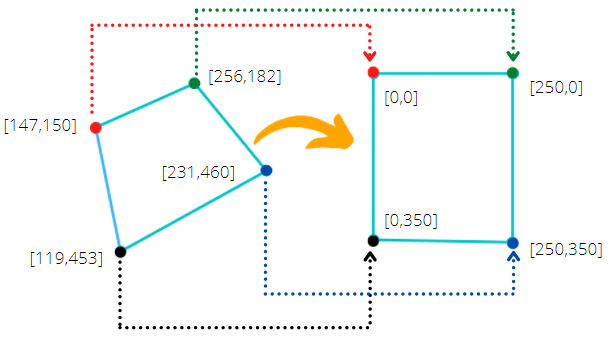

<div class="grid cards" markdown>
- :ledger: Para acompanhar esta seção, abra o arquivo `notebooks/3-transformacoes.ipynb`.
</div>

As transformações geométricas em OpenCV são usadas para alterar a posição, o tamanho, a orientação ou a forma de uma imagem. Isso é fundamental em tarefas de visão computacional, como o ajuste de perspectiva, rotação de imagens e alinhamento de objetos.

Nesta seção vamos abordar os seguintes itens:

1. Redimensionamento de imagens
   1. Extra: Operações matemáticas entre imagens
2. Transformação de Perspectiva (*Warp Perspective*)

---
## Importando as bibliotecas necessárias

Vamos iniciar importando as bibliotecas necessárias para esta seção: `numpy`, `cv2` e `matplotlib.pyplot`.

```python
# Importe as bibliotecas necessarias:
import numpy as np
import cv2
import matplotlib.pyplot as plt
```

---
## Redimensionamento de Imagens

O redimensionamento altera o tamanho da imagem, aumentando ou reduzindo sua largura e altura.

```python
# Carregue a imagem `media/gatogordo.jpg` no formato BGR
imagem = cv2.imread("media/gatogordo.jpg", 1)

# Converta a imagem para RGB
imagem_rgb = cv2.cvtColor(imagem, cv2.COLOR_BGR2RGB)

# Exiba a imagem
plt.imshow(imagem)
```

A função `cv2.resize()` permite a operação de redimensionamento de imagens.

```python
# Redimensione a imagem para o tamanho desejado
imagem_redim = cv2.resize(imagem, (64, 64))

# Exiba a imagem redimensionada
plt.imshow(imagem_redim)
```

---
### Extra: Operações Matemáticas entre Imagens

Operações entre imagens diferentes pode ser útil em vários cenários. **Podemos somar, subtrair e multiplicar imagens, afinal elas são matrizes**. Uma das utilidades da soma entre imagens é para a inclusão de marca d'água.

Vamos inserir o logo da UFPA como marca d'água na imagem do gato gordo!

```python
# Carregue o logo da UFPA e converter para RGB
logo = cv2.cvtColor(cv2.imread("media/logo.png"), cv2.COLOR_BGR2RGB)

# Exiba o logo da UFPA
plt.imshow(logo)
```

Precisamos redimensionar o logo para que ele tenha o mesmo tamanho da imagem

```python
# Redimensione o logo para 1250x1250
logo_redim = cv2.resize(logo, (1250, 1250))

# Exiba o logo redimensionado
plt.imshow(logo_redim)
```

Agora que as duas imagens tem dimensões compatíveis, podemos somá-las com a função `cv2.add()`.

```python
# Some as duas imagens
soma = cv2.add(imagem, logo_redim)

# Exiba a imagem resultante
plt.imshow(soma)
```

Simplesmente somar as duas imagens não é o ideal para a inserção de marcas d'água. Devemos realizar uma soma ponderada com a função `cv2.addWeighted()`.

```python
# Use a soma ponderada para combinar as imagens
soma_ponderada = cv2.addWeighted(
    src1=imagem, alpha=1, src2=logo_redim, beta=0.10, gamma=0
)

# Exibir a imagem
plt.imshow(soma_ponderada)
```

---
## Transformação de Perspectiva (Warp Perspective)

Muitas vezes o objeto de interesse não está sendo visto diretamente na imagem, dificultando o seu processamento. A transformação de perspectiva é uma boa solução para simular o ponto de vista ideal do objeto.



Para ilustrar esta transformação, utilizaremos o a imagem `media/dragon.png`.

```python
# Carregar a imagem `media/dragon.png` e converter para RGB
dragon = cv2.cvtColor(cv2.imread("media/dragon.jpg"), cv2.COLOR_BGR2RGB)

# Exibir a imagem
plt.imshow(dragon)
```

Aqui queremos ver a carta com uma vista de cima. Para isso, temos que encontrar os quatro pontos da imagem original.

```python
# Faça uma cópia da imagem para desenhar os pontos
pontos = dragon.copy()

# Encontre os quatro pontos na imagem
# Ponto 1
ponto1 = (770, 535)
cv2.circle(pontos, ponto1, 20, (255,0,0), -1)

# Ponto 2
ponto2 = (945, 705)
cv2.circle(pontos, ponto2, 20, (255, 0, 0), -1)

# Ponto 3
ponto3 = (160, 630)
cv2.circle(pontos, ponto3, 20, (255, 0, 0), -1)

# Ponto 4
ponto4 = (185, 870)
cv2.circle(pontos, ponto4, 20, (255, 0, 0), -1)

# Transforme os pontos em um array do numpy
pontos_origem = np.float32([ponto1, ponto2, ponto3, ponto4])

# Conectando os pontos, para visualização
cv2.line(pontos, ponto1, ponto2, (0, 255, 0), 5)
cv2.line(pontos, ponto2, ponto4, (0, 255, 0), 5)
cv2.line(pontos, ponto4, ponto3, (0, 255, 0), 5)
cv2.line(pontos, ponto3, ponto1, (0, 255, 0), 5)

# Exiba a imagem com os pontos conectados
plt.imshow(pontos)
```

Agora precisamos definir os pontos nas coordenadas de destino:

```python
# Defina o tamanho da imagem resultante
width, height = 250, 400 

# Defina os quatro pontos de destino para transformar a perspectiva
pontos_destino = np.float32([[0, 0], [width, 0], [0, height], [width, height]])
```

Agora que temos o conjunto de pontos de origem e de destino, podemos calcular a matriz de transformação de perspectiva e aplicar a transformação.

```python
# Obtenha a matriz de transformação de perspectiva
matriz = cv2.getPerspectiveTransform(pontos_origem, pontos_destino)

# Realize a transformação de perspectiva
carta = cv2.warpPerspective(dragon, matriz, (width, height))

# Exiba a imagem resultante
plt.imshow(carta)
```


<div class="grid cards" markdown>
- :arrow_right:  Continua na próxima seção: [**Operações de Filtragem**](4-Operações-de-Filtragem.md).
</div>