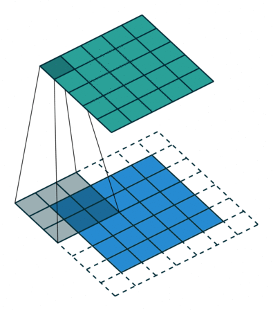

<div class="grid cards" markdown>
- :ledger: Para acompanhar esta seção, abra o arquivo `notebooks/4-filtros.ipynb`.
</div>

As operações de filtragem são técnicas fundamentais em processamento de imagens, utilizadas para modificar ou realçar determinadas características de uma imagem, como suavizar ruídos, realçar detalhes ou detectar bordas. Essas operações funcionam aplicando um filtro (ou kernel) sobre a imagem, que consiste em uma pequena matriz de números. Cada valor da imagem é ajustado com base nos seus vizinhos, conforme definido pelo filtro.

As operações de filtragem podem ser vistas como o processo de convolução de uma imagem com um kernel. O kernel passa por cada pixel da imagem, calculando o valor do novo pixel com base em seus vizinhos. As diferentes escolhas de kernels resultam em diversos tipos de filtros, como suavização, nitidez, e detecção de bordas.

{.center}

---
## Importando as bibliotecas necessárias

Vamos iniciar importando as bibliotecas necessárias para esta seção: `numpy`, `cv2` e `matplotlib.pyplot`.

```python
# Importe as bibliotecas necessarias:
import numpy as np
import cv2
import matplotlib.pyplot as plt
```

---
## Deslizamento de Filtros na Imagem

```python
# Carregue a imagem `media/gengar.png` no formato BGR
imagem = cv2.imread("media/gengar.png", 1)

# Converta a imagem para RGB
imagem_rgb = cv2.cvtColor(imagem, cv2.COLOR_BGR2RGB)

# Exiba a imagem
plt.imshow(imagem)
```

Vamos criar filtros (kernels) 3x3 para diversas tarefas.

Detecção de Linhas Horizontais:

```python 
# Defina um kernel para detecção de linhas horizontais
kernel_horizontal = np.array([[1, 1, 1], [0, 0, 0], [-1, -2, -1]])

# Realize o deslizamento do kernel na imagem
horizontais = cv2.filter2D(imagem_rgb, -1, kernel_horizontal)

# Exiba a imagem resultante
plt.imshow(horizontais)
```

Detecção de Linhas Verticais:

```python
# Definir um kernel para detecção de linhas verticais
kernel_vertical = np.array([[1, 0, -1], [1, 0, -1], [1, 0, -1]])

# Realizar deslizamento do kernel na imagem
verticais = cv2.filter2D(imagem_rgb, -1, kernel_vertical)

# Exibir a imagem resultante
plt.imshow(verticais)
```

Combinação das linhas verticais e horizontais:

```python
# Some as detecções horizontais e verticais
soma = horizontais + verticais

# Exiba a imagem resultante
plt.imshow(soma)
```

---
## Filtros de Detecção de Bordas

Filtros de detecção de bordas são essenciais para identificar contornos de objetos em uma imagem. Eles funcionam realçando as áreas onde há transições abruptas de intensidade (bordas).

- Filtro Sobel
- Filtro Canny
- Filtro Prewitt

Vamos testar o Algoritmo **Canny Edge Detection**:

```python
# Aplique o filtro de Canny para detecção de bordas
bordas = cv2.Canny(imagem_rgb, 150, 210)

# Exiba a imagem resultante
plt.imshow(bordas, cmap="Spectral")
```

---
## Filtros de Suavização (Blur)

Filtros de suavização são usados para reduzir ruídos e variações bruscas na intensidade dos pixels. Eles são frequentemente usados para melhorar a qualidade visual da imagem, reduzindo o ruído ou granulação.

- Filtro de Média
- Filtro Gaussiano
- Filtro Bilateral
- Filtro de Mediana

```python
# Defina uma tupla para o tamanho do filtro
tamanho_do_filtro = (5, 5)

# Aplique o filtro de média na imagem
imagem_borrada = cv2.blur(imagem_rgb, tamanho_do_filtro)

# Exiba a imagem resultante
plt.imshow(imagem_borrada)
```

<div class="grid cards" markdown>
- :arrow_right:  Continua na próxima seção: [**Operações de Limiarização e Detecção de Contornos**](5-Operações-de-Limiarização-e-Detecção-de-Contornos.md).
</div>