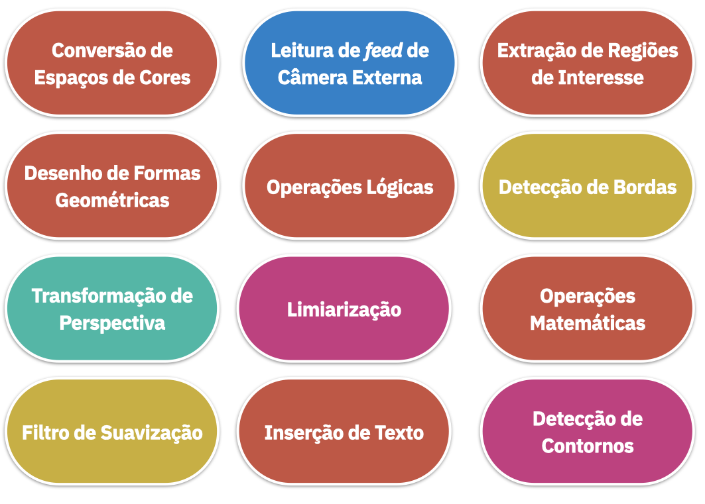

> :bulb: **Discussão: Como utilizar uma combinação das técnicas apresentadas em um único projeto?**

- :archery: **Objetivo do Projeto:** Elaborar um protótipo de sistema para **Detecção de Movimento** em uma câmera de segurança.

- Elaborar um script python (`scripts/movement.py`)
- O script deve ler o *feed* de uma webcam
- Deve aplicar as técnicas necessárias para detectar movimentos no vídeo
- A saída deve apresentar as detecções dentro de caixas delimitadoras

> :bulb: **Dica: a metodologia é composta de seis passos dentre os citados acima.**

