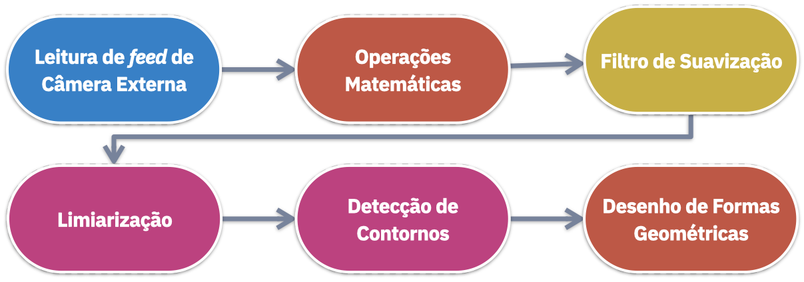

# Projeto Final

<div class="grid cards" markdown>
- :archery: **Objetivo do Projeto:** Elaborar um protótipo de sistema para **Detecção de Movimento** em uma câmera de segurança.
</div>

- Elaborar um script python (`scripts/movement.py`)
- O script deve ler o *feed* de uma webcam
- Deve aplicar as técnicas necessárias para detectar movimentos no vídeo
- A saída deve apresentar as detecções dentro de caixas delimitadoras

# Metodologia 

A metodologia proposta como solução para o projeto é a seguinte:



# Solução

O código a seguir implementa as funcionalidades requisitadas:

```python
# ---------------------------------------------------------------------------- #
#                                 Projeto Final                                #
# ---------------------------------------------------------------------------- #

# Objetivo: Implementar uma metodologia de detecção de movimentos em um feed de video
# Passo a Passo:
# 1. Leitura de feed de Webcam
# 2. Subtrair o frame atual do frame anterior
# 3. Aplicar filtro de GaussianBlur
# 4. Aplicar Limiarização
# 5. Encontrar os contornos dos movimentos
# 6. Desenhar bounding boxes

# Importar as bibliotecas necessárias
import cv2

# Criar o objeto Capture (Selecionar o id da webcam correta)
capture = cv2.VideoCapture(2)

# Ler frames de webcam
ret, frame1 = capture.read()
ret, frame2 = capture.read()

while capture.isOpened():
    # Subtrair o frame atual do frame anterior
    diff = cv2.absdiff(frame1, frame2)

    # Converter para escala de cinza
    gray = cv2.cvtColor(diff, cv2.COLOR_BGR2GRAY)

    # Aplicar Gaussian Blur
    blur = cv2.GaussianBlur(gray, (15, 15), 0)

    # Aplicar Limiarização
    _, thresh = cv2.threshold(blur, 20, 255, cv2.THRESH_BINARY)

    # Encontrar os contornos
    contornos, _ = cv2.findContours(
        thresh, cv2.RETR_TREE, cv2.CHAIN_APPROX_SIMPLE
    )

    for contorno in contornos:
        # Desenhar as caixas delimitadoras
        (x, y, w, h) = cv2.boundingRect(contorno)

        # Filtrar contornos com área menor que 3000
        # Ajustar o valor se necessário
        if cv2.contourArea(contorno) < 3000:
            continue

        # Desenhar o retângulo
        cv2.rectangle(frame1, (x, y), (x + w, y + h), (0, 255, 0), 5)

        # Alerta de Movimento
        cv2.putText(
            frame1,
            "Movimento Detectado!",
            (30, 80),
            cv2.FONT_HERSHEY_PLAIN,
            4,
            (0, 0, 255),
            4,
        )

    # Visualizar frame
    cv2.imshow("Frame", frame1)

    # Próximo frame
    frame1 = frame2
    ret, frame2 = capture.read()

    # Aguardar botão para fechar janelas
    if cv2.waitKey(40) == ord("q"):
        break

cv2.destroyAllWindows()
capture.release()

```

