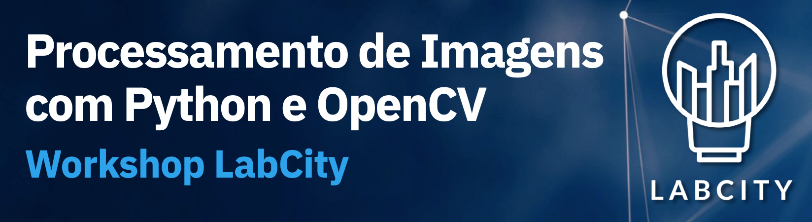

> **Duração:** 02 horas

> **Data:** 08/09/2024

> **Horário:** 14:00

> **Local:** [Centro de Computação de Alto Desempenho - UFPA](https://maps.app.goo.gl/BkW6Ry8ZRGAkagEs5)

> **Ministrado por:** Carlos André Mattos ([@andrematte](https://github.com/andrematte) - LabCity - UFPA)

## Sobre este Workshop
Este workshop explorará, na prática, as ferramentas básicas utilizadas em projetos de Visão Computacional. A compreensão dessas técnicas é crucial para construir uma base sólida em manipulação e processamento de imagens, facilitando a aplicação mais eficaz de algoritmos de Machine Learning em projetos futuros.

Os materiais necessários para o acompanhamento do workshop estão disponíveis no [GitHub](https://github.com/andrematte/workshop-opencv). 

Os conteúdos da aula prática foram implementados no formato de Jupyter Notebooks e estão armazenados no diretório `notebooks`. Já o Projeto Final será implementado em um script Python puro, localizado em `scripts/projetofinal.py`.

## Pré-requisitos
- Conhecimentos básicos de programação na linguagem Python
- Computador pessoal com Python 3.x instalado para a execução dos exercícios
- Ambiente Python configurado e com as seguintes bibliotecas instaladas:
    - NumPy
    - OpenCV
    - MatPlotLib
    - Jupyter (Opcional)

- :gear: [**Instruções para configuração do ambiente**](configuração.md)

## Conteúdo do Workshop
1. [**Introdução ao OpenCV**](Conteúdo-do-Workshop/1-Introdução-ao-OpenCV.md)
      1. Representação matricial de imagens digitais
      2. Leitura, exibição e armazenamento de imagens
      3. Trabalhando com arquivos de vídeo
      4. Trabalhando com o *feed* de uma câmera externa
2. [**Operações básicas**](Conteúdo-do-Workshop/2-Operações-Básicas.md)
      1. Conversão entre espaços de cores (Escala de cinza, RGB, HSV)
      2. Extração de Regiões de Interesse (ROI)
      3. Desenhando formas geométricas nas imagens
      4. Inserindo texto nas imagens
      5. Operações lógicas
3. [**Transformações geométricas**](Conteúdo-do-Workshop/3-Transformações-Geométricas.md)
      1. Redimensionamento
      2. Transformação de perspectiva
4. [**Operações de filtragem**](Conteúdo-do-Workshop/4-Operações-de-Filtragem.md)
      1. Aplicação de filtros (*kernels*) na imagem
      2. Filtros de suavização
      3. Filtros de detecção de bordas
5. [**Operações de limiarização e detecção de contornos**](Conteúdo-do-Workshop/5-Operações-de-Limiarização-e-Detecção-de-Contornos.md)
      1. Operações de limiarização
      2. Detecção de contornos
6. [**Projeto Final**](Projeto-Final/Projeto-Final.md)

